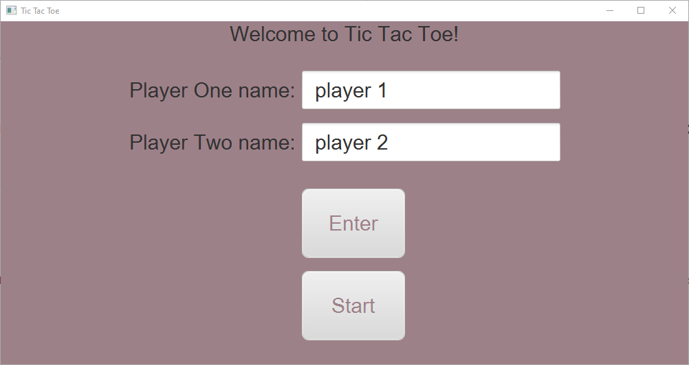
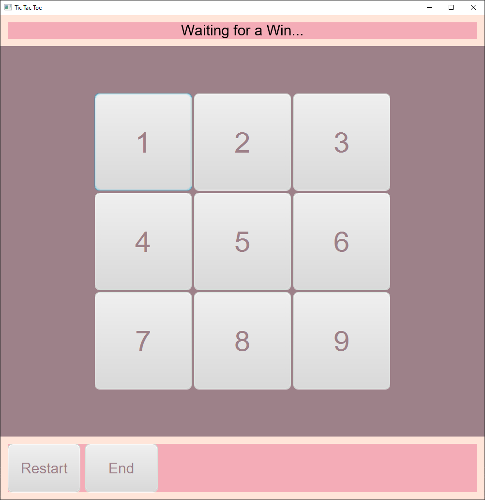
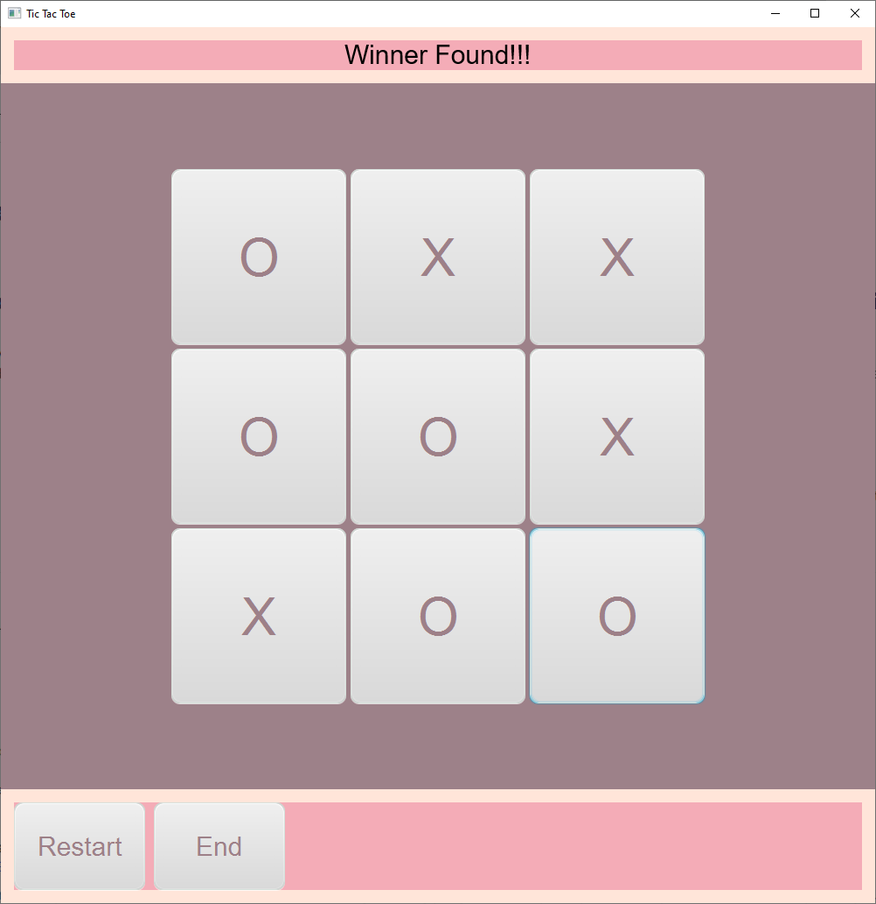

# Tic Tac Toe

### Tic Tac Toe Game using JavaFX with CSS styling.
:video_game:
Directions: Start Program by running Java file: Main.java
 
------------------------------------------------------------------------
 
 ### Start menu
 
 
 ### Game menu
 
 
 ### Winner menu
 

 -----------------------------------------------------------------------------------------------

 ### Lessons Learned:
 * Searching for reference/similar programs make the planning process more efficient timewise.
 * Loops = less repetitive code for repetitive tasks. 
 * Next time, I would like to work out my design plan/color scheme on a program like Adobe XD or photoshop. 
